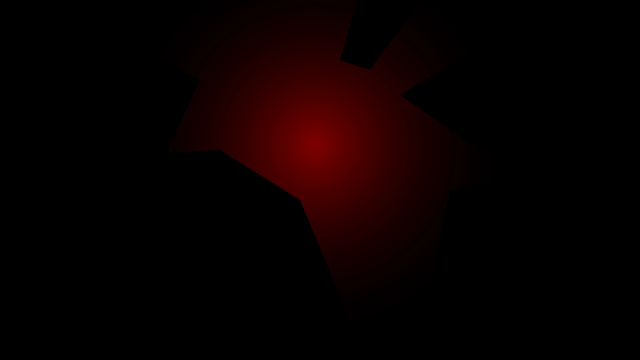

# SFML-lit

A simple light system made in SFML, thanks to [Sight & Light](https://ncase.me/sight-and-light/)<br><br>

# Demo



# Example

```c++
#include <SFML/Graphics.hpp>
#include "light.hpp"

int main()
{
    sf::RenderWindow window(sf::VideoMode(640, 360), "SFML Lit", sf::Style::Close);
    window.setFramerateLimit(60);
    window.setMouseCursorVisible(false);

    std::vector<lit::Line> segments = {
        // Border
        lit::Line{{0, 0}, {640, 0}},
        lit::Line{{640, 0}, {640, 360}},
        lit::Line{{640, 360}, {0, 360}},
        lit::Line{{0, 360}, {0, 0}},

        // Polygon #1
        lit::Line{{100, 150}, {120, 50}},
        lit::Line{{120, 50}, {200, 80}},
        lit::Line{{200, 80}, {140, 210}},
        lit::Line{{140, 210}, {100, 150}},

        // Polygon #2
        lit::Line{{100, 200}, {120, 250}},
        lit::Line{{120, 250}, {60, 300}},
        lit::Line{{60, 300}, {100, 200}},

        // Polygon #3
        lit::Line{{200, 260}, {220, 150}},
        lit::Line{{220, 150}, {300, 200}},
        lit::Line{{300, 200}, {350, 320}},
        lit::Line{{350, 320}, {200, 260}},

        // Polygon #4
        lit::Line{{340, 60}, {360, 40}},
        lit::Line{{360, 40}, {370, 70}},
        lit::Line{{370, 70}, {340, 60}},

        // Polygon #5
        lit::Line{{450, 190}, {560, 170}},
        lit::Line{{560, 170}, {540, 270}},
        lit::Line{{540, 270}, {430, 290}},
        lit::Line{{430, 290}, {450, 190}},

        // Polygon #6
        lit::Line{{400, 95}, {580, 50}},
        lit::Line{{580, 50}, {480, 150}},
        lit::Line{{480, 150}, {400, 95}}
    };
    
    lit::Light light(segments);
    light.init();

    light.setColor({255, 0, 0});
    light.setIntensity(0.5f);
    light.setEnergy(0.5f);
    light.setPosition({320, 140});

    while (window.isOpen())
    {
        sf::Event event;
        while (window.pollEvent(event))
        {
            if (event.type == sf::Event::Closed)
            {
                window.close();
            }
            else if (event.type == sf::Event::MouseMoved)
            {
                sf::Vector2f mouse(event.mouseMove.x, event.mouseMove.y);
                light.setPosition(mouse);
            }
        }

        window.clear();
        light.draw(window, true);
        window.display();
    }

    return 0;
}
```
